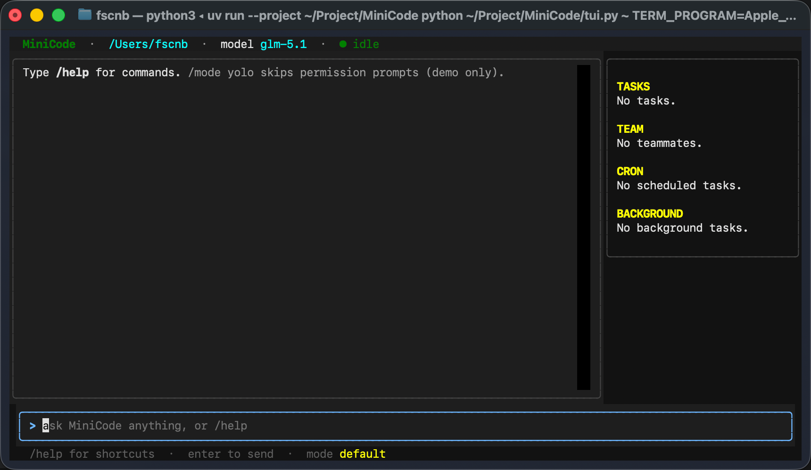

# MiniCode

单文件、可运行、保留主要工程机制的本地 coding agent。

`main.py` 一个文件实现 agent loop、工具调用、子代理、skills、上下文压缩、权限、hooks、跨会话 memory、任务板、后台任务、定时任务、多代理协作、worktree、MCP 等机制；`tui.py` 提供 Textual 界面。

## 安装

需要 [uv](https://docs.astral.sh/uv/) 和一个 Anthropic 协议端点的 API key（官方或代理均可）。

```bash
git clone https://github.com/FuSC24/MiniCode.git && cd MiniCode
uv sync
cp .env.example .env   # 填 ANTHROPIC_API_KEY 和 MODEL_ID
```

可选：把全局命令链到 PATH 上。

```bash
ln -s "$(pwd)/bin/minicode" ~/.local/bin/minicode
```

## 使用



```bash
uv run python tui.py        # TUI 界面（推荐）
uv run python main.py       # 纯文本 REPL

# 全局命令（链到 PATH 后）
minicode                    # 当前目录启动 TUI
minicode ~/some-project     # 指定工作目录
minicode --repl             # 退回纯文本 REPL
minicode --mode yolo        # 启动时直接进 yolo 模式
```

进入 REPL/TUI 后输入 `/help` 看所有命令。常用：

| 命令 | 说明 |
|---|---|
| `/mode <name>` | 权限模式：`default` / `plan` / `auto` / `yolo` |
| `/tasks` `/team` `/memory` `/skills` | 查看对应状态 |
| `/compact <focus>` | 手动压缩上下文 |
| `/quit` | 退出 |

非 `/` 开头的输入直接发给模型。

## 配置

`.env` 字段：

```bash
ANTHROPIC_API_KEY=sk-...           # 必填
MODEL_ID=claude-opus-4-6           # 必填，按你用的模型填
ANTHROPIC_BASE_URL=https://...     # 可选，Anthropic 兼容代理
MINICODE_PERM_MODE=default         # 可选，启动时的权限模式
MINICODE_CACHE=0                   # 可选，关闭 prompt caching
```

## 扩展

- **Skill**：在 `skills/<name>/SKILL.md` 写带 frontmatter 的指令，模型按需调 `load_skill` 拉取。
- **Hook**：在工作目录放 `.hooks.json`，`/trust` 后生效。
- **MCP**：在 `.minicode/mcp/config.json` 注册 stdio MCP server。
- **Memory**：模型调 `save_memory` 把跨会话信息写到 `.memory/`，下次启动自动加载。

## License

MIT
